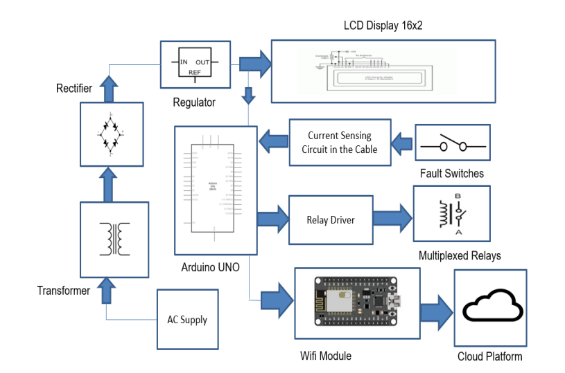
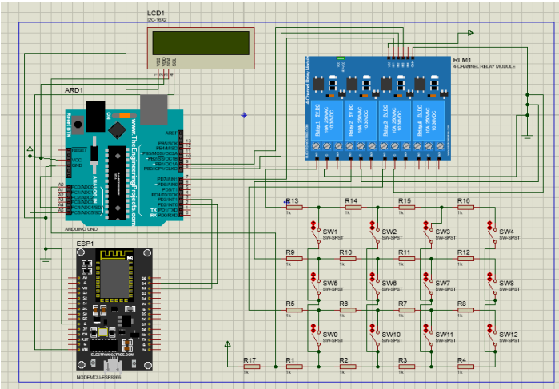
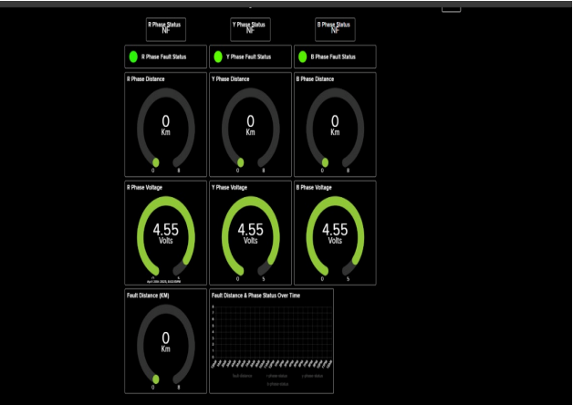
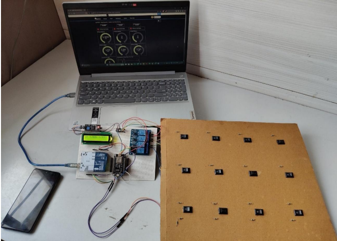

# ⚡ IoT-Based Underground Cable Fault Detection System

An IoT-enabled system that detects and locates underground cable faults in three-phase power lines using Arduino UNO, ESP8266, and Adafruit IO. The system calculates the approximate fault distance based on voltage drop and provides real-time monitoring through an LCD display and cloud dashboard.

---


## 📖 Project Overview

Underground cable faults are difficult to identify manually and often require significant time to locate. This project automates the fault detection process by identifying the faulty phase (R, Y, or B), estimating the fault distance, and uploading the data to the cloud for remote monitoring.

The system was developed as a Final Year B.E. Electronics and Telecommunication Engineering project.

---

## ✨ Features

* Detects faults in R, Y, and B phases
* Estimates fault distance (2 km, 4 km, 6 km, 8 km)
* Displays fault information on a 16x2 I2C LCD
* Uploads real-time data to Adafruit IO using ESP8266
* Cloud-based monitoring through MQTT
* Low-cost prototype suitable for academic demonstration

---

## 🛠 Hardware Components

* Arduino UNO
* ESP8266 NodeMCU
* 16x2 I2C LCD Display
* 4-Channel Relay Module
* Resistors
* Switches
* Breadboard
* Jumper Wires
* Power Supply

---

## 💻 Software & Technologies

* Arduino IDE
* Embedded C/C++
* ESP8266 Wi-Fi Module
* MQTT Protocol
* Adafruit IO
* Git & GitHub

---

## ⚙️ Working Principle

1. Faults are simulated using switches and resistor networks.
2. Arduino continuously monitors the voltage.
3. The voltage drop is used to estimate the fault distance.
4. The faulty phase is identified.
5. Data is transmitted to the ESP8266 using serial communication.
6. ESP8266 publishes the data to Adafruit IO using MQTT.
7. The LCD and cloud dashboard display the detected fault information.

---

## 🖼 Block Diagram



---

## 🔌 Circuit Diagram



---

## ☁ Cloud Dashboard



The dashboard displays:

* Fault Status
* Fault Distance
* Phase Information
* Real-Time Updates

---

## 📷 Prototype



---

## 📂 Project Structure

```text
.
├── Code
│   ├── Arduino_UNO_Code.ino
│   └── ESP8266_Code.ino
│
├── Images
│   ├── block-diagram.png
│   ├── circuit-diagram.png
│   ├── dashboard.png
│   └── prototype.png
│
├── Report
│   └── Project_Report.pdf
│
└── README.md
```

---

## 🚀 How to Run

1. Upload the Arduino sketch to the Arduino UNO.
2. Upload the ESP8266 sketch using Arduino IDE.
3. Configure Wi-Fi credentials and Adafruit IO keys.
4. Connect the hardware according to the circuit diagram.
5. Power the system.
6. Monitor the LCD and Adafruit IO dashboard.

---

## 📈 Future Improvements

* GPS-based fault localization
* Mobile application support
* SMS and Email notifications
* Battery backup
* Support for longer cable distances

---

## 👨‍💻 Author

**Purushottam Apte**

Final Year B.E. Electronics & Telecommunication Engineering
PES Modern College of Engineering, Pune

📧 **Email:** [aptepuru19@gmail.com](mailto:aptepuru19@gmail.com)

🔗 **GitHub:** https://github.com/Purushottam-13

💼 **LinkedIn:** https://www.linkedin.com/in/purushottam-apte/

---

## 🤝 Project Information

This repository contains the complete implementation and documentation of the IoT-Based Underground Cable Fault Detection System. The project was developed as a Final Year B.E. Electronics & Telecommunication Engineering team project, and this repository is maintained by Purushottam Apte.

### Team Members

* Purushottam Apte
* Jay Ganesh Dukare
* Ojas Vijay Hadgal

---

## 📄 Usage

This project is shared for educational and portfolio purposes. Please provide appropriate attribution before reusing or modifying this work.
